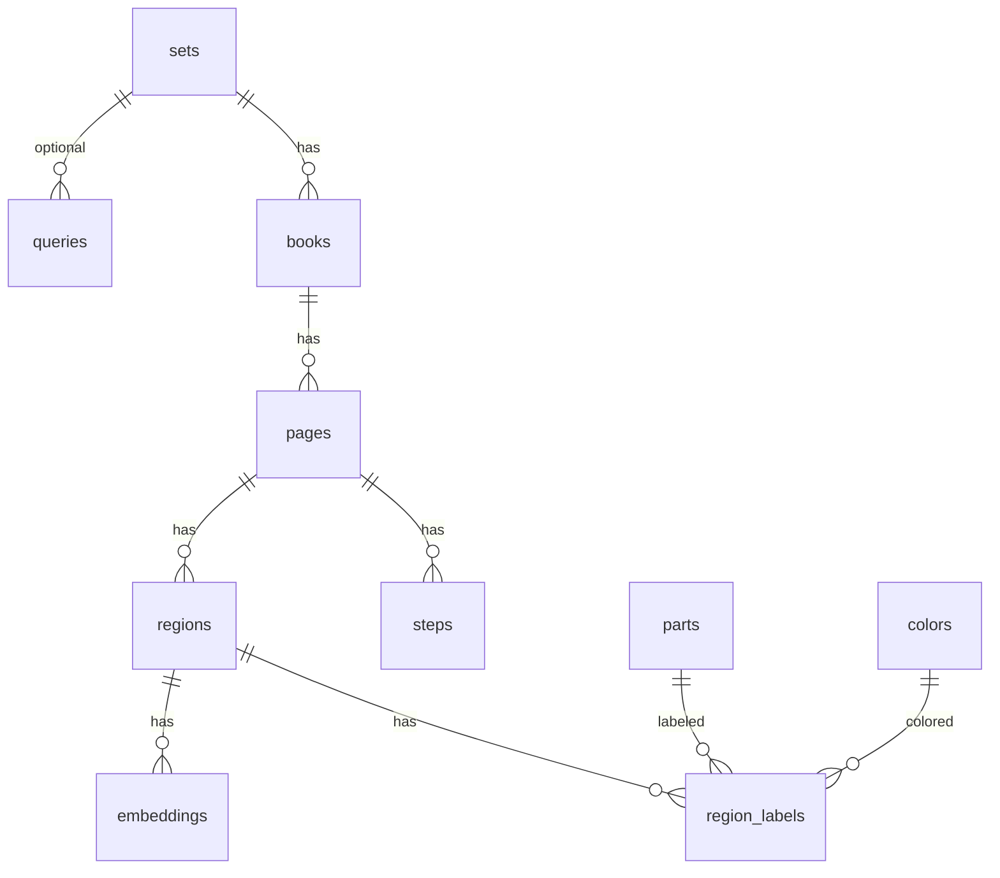

# Schema

SQLite file: `{DATA_PATH}/db/brickfinder.db` (Compose bind-mount: host `./data` → `/data`, so the live DB is `data/db/brickfinder.db` in this repo; gitignored).

Paths stored on rows are relative to `DATA_PATH` (posix, no leading slash), e.g. `media/sets/1/books/2/pages/0042.jpg`.

Vectors are **float32 little-endian blobs** on `embeddings.vector`. kNN is in-process (numpy). Layout is compatible with a later sqlite-vec virtual table keyed by the same `region_id` + `model_name`. Default index is DINOv2-small (384-d). CLIP is search-time only and is not stored.

## sets

| Column | Type | Notes |
| --- | --- | --- |
| id | INTEGER PK | |
| set_num | TEXT NULL | Official number when known (e.g. `75367-1`) |
| name | TEXT NOT NULL | Folder name, unique |

## books

| Column | Type | Notes |
| --- | --- | --- |
| id | INTEGER PK | |
| set_id | FK sets | |
| book_number | INTEGER | Order within the set |
| source_relpath | TEXT | Path relative to `INSTRUCTIONS_PATH` |
| content_sha256 | TEXT UNIQUE | Identity of the booklet |
| size_bytes | INTEGER | |
| page_count | INTEGER | |
| source_missing | BOOLEAN | PDF gone from disk; index kept |
| ingest_status | TEXT | `in_progress` or `complete` |

## pages

| Column | Type | Notes |
| --- | --- | --- |
| id | INTEGER PK | |
| book_id | FK books | |
| page_number | INTEGER | 1-based PDF page |
| raster_path | TEXT | JPEG |
| thumb_path | TEXT | Narrow JPEG for the browser |
| width | INTEGER | |
| height | INTEGER | |

## steps

| Column | Type | Notes |
| --- | --- | --- |
| id | INTEGER PK | |
| page_id | FK pages | |
| step_number | INTEGER NULL | From PDF text |
| bag_number | INTEGER NULL | From PDF text |

## regions

| Column | Type | Notes |
| --- | --- | --- |
| id | INTEGER PK | |
| page_id | FK pages | |
| kind | TEXT | `assembly` \| `callout` \| `inventory` |
| bbox_x, bbox_y, bbox_w, bbox_h | INTEGER | Pixels on the raster |
| crop_path | TEXT | |
| mask_path | TEXT | PNG alpha/mask |

## parts / colors

Local catalog placeholders (`design_id` / `name`, `lego_id` / `name` / `hex`). Unused in v1 search.

## region_labels

`region_id`, `part_id`, `color_id`, `qty`, `confidence`, `source` (`ocr` \| `vision` \| `human`).

## embeddings

| Column | Type | Notes |
| --- | --- | --- |
| id | INTEGER PK | |
| region_id | FK regions | |
| model_name | TEXT | `dinov2-small` (default index) or `histogram-hsv-256`. CLIP (`clip-vit-b-32`) is not stored. |
| vector | BLOB | float32, L2-normalized |
| silhouette | BLOB | float32 32×32 mask, L2-normalized |

Unique `(region_id, model_name)`.

## queries

Upload path, mask path, predicted/override kind, top-k JSON, optional `correct_page_id` / `correct_region_id` from feedback.
